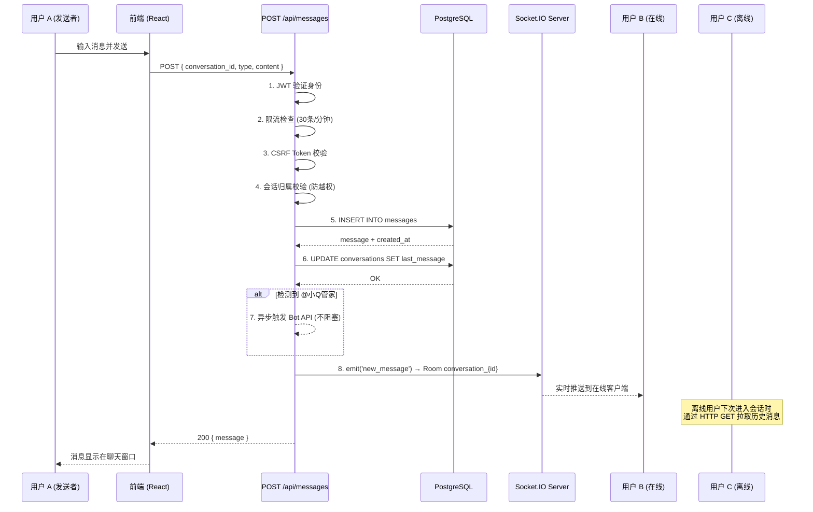
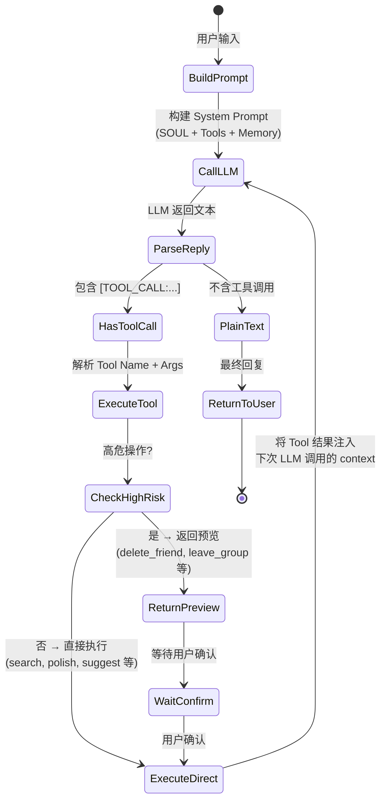

# 架构文档完善工作单

## TL;DR

> **目标**：对 `docs/architecture.md` 执行 10 项精准改进，将从 "85 分" 提升到 "95 分"。
> 
> **策略**：所有编辑基于 `oldString → newString` 精确替换，零破坏风险。

---

## 改进清单（10 项）

### 1. 更新文档版本号

- **位置**：文件开头 `<h1>` 下方 `>` 引用块
- **匹配**：`> 版本：v1.0`
- **替换为**：`> 版本：v1.1`

### 2. 补充分布式部署拓扑图

- **位置**：`### 3.1 架构风格` 三个要点之后，`---` 分隔线之前
- **插入内容**：

```markdown

### 3.2 部署拓扑视图

```
                         ┌─────────────────┐
                         │   CDN / Edge     │
                         │ (Static Assets)  │
                         └────────┬────────┘
                                  │
                         ┌────────┴────────┐
                         │  Nginx / Caddy  │  ← 反向代理 (TLS 终结)
                         │  Reverse Proxy  │
                         └────────┬────────┘
                                  │
              ┌───────────────────┼───────────────────┐
              │                   │                   │
     ┌────────┴────────┐ ┌───────┴───────┐ ┌────────┴────────┐
     │  App Instance 1 │ │ App Instance 2│ │  App Instance N │
     │  (Node.js)      │ │ (Node.js)     │ │  (Node.js)      │
     │  Next.js +      │ │ Next.js +     │ │  Next.js +      │
     │  Socket.IO      │ │ Socket.IO     │ │  Socket.IO      │
     └────────┬────────┘ └───────┬───────┘ └────────┬────────┘
              │                   │                   │
              │    ┌──────────────┼──────────────┐    │
              │    │  Redis Pub/Sub (Socket.IO    │    │
              │    │  Adapter — 跨节点广播)        │    │
              │    └──────────────┼──────────────┘    │
              │                   │                   │
     ┌────────┴───────────────────┴───────────────────┴────────┐
     │                      数据层                              │
     │  ┌──────────────────┐ ┌──────────┐ ┌──────────────────┐ │
     │  │ PostgreSQL       │ │  Redis   │ │  S3 / Supabase   │ │
     │  │ (Supabase)       │ │ (缓存/   │ │  Storage         │ │
     │  │ 主从 + 连接池     │ │  限流)   │ │  (文件/图片)      │ │
     │  └──────────────────┘ └──────────┘ └──────────────────┘ │
     └─────────────────────────────────────────────────────────┘
              │                   │
     ┌────────┴───────────────────┴────────┐
     │            外部服务                   │
     │  OpenAI API │ DashScope │ Embedding  │
     └──────────────────────────────────────┘
```

> **单实例模式（当前）**：仅部署 1 个 App Instance。Socket.IO 无需 Redis Adapter。
> **多实例模式（扩展）**：部署 N 个 App Instance 时必须启用 Redis Adapter（`@socket.io/redis-adapter`），否则不同节点上的客户端无法互通消息。定时任务需迁移至独立 Workers 或引入分布式锁。
```

### 3. 消息发送流程替换为 Mermaid 序列图

- **位置**：`### 5.4 消息发送与实时推送流程` 整个章节
- **匹配**：从 `### 5.4 消息发送与实时推送流程` 到 `---` 分隔线之前的所有内容
- **替换为**：

```markdown
### 5.4 消息发送与实时推送流程



> **关键时序**：消息先入库（持久化），再广播（实时推送），最后响应客户端。这确保了即使广播失败也不会丢失消息。
```

### 4. API 路由表增加读写标记

- **位置**：`### 5.2 API 路由设计` 表格
- **OLD**：表头为 `| 资源 | 路由 | 方法 | 说明 |`
- **NEW**：表头增加 `读写` 列

需要将整张表替换为带读写标记的版本：

```markdown
| 资源 | 路由 | 方法 | 读写 | 说明 |
|------|------|------|------|------|
| 认证 | `/api/auth/login` | POST | W | 登录 |
| 认证 | `/api/auth/register` | POST | W | 注册 |
| 认证 | `/api/auth/logout` | POST | W | 登出 |
| 认证 | `/api/auth/verify` | GET | R | 验证登录态 |
| 用户 | `/api/user` | GET | R | 获取用户信息 |
| 用户 | `/api/user` | PUT | W | 更新用户信息 |
| 好友 | `/api/friends` | GET | R | 好友列表 |
| 好友 | `/api/friends/[id]` | GET | R | 好友详情 |
| 好友 | `/api/friends/[id]` | PUT | W | 更新好友备注 |
| 会话 | `/api/conversations` | GET | R | 会话列表 |
| 会话 | `/api/conversations` | POST | W | 创建会话 |
| 会话 | `/api/conversations/[id]` | GET | R | 会话详情 |
| 消息 | `/api/messages` | GET | R | 消息列表（分页） |
| 消息 | `/api/messages` | POST | W | 发送消息 |
| 群组 | `/api/groups` | GET | R | 群列表 |
| 群组 | `/api/groups/members` | GET | R | 群成员 |
| 动态 | `/api/moments` | GET | R | 动态列表 |
| 动态 | `/api/moments` | POST | W | 发布动态 |
| 动态 | `/api/moments/[id]` | PUT | W | 编辑动态 |
| 动态 | `/api/moments/[id]` | DELETE | W | 删除动态 |
| 动态 | `/api/moments/like` | POST | W | 点赞/取消 |
| 动态 | `/api/moments/comment` | POST | W | 评论 |
| 管家 | `/api/bot` | GET | R | 获取 Bot 配置 |
| 管家 | `/api/bot` | POST | W | 发送 Bot 消息 |
| 管家 | `/api/bot/stream` | POST | W | 流式对话 |
| 管家 | `/api/bot/audit-logs` | GET | R | 审计日志 |
| 上传 | `/api/upload` | POST | W | 文件/图片上传 |
| 设置 | `/api/settings` | GET | R | 获取设置 |
| 设置 | `/api/settings` | PUT | W | 更新设置 |
| 任务 | `/api/tasks` | GET | R | 任务列表 |
| 任务 | `/api/tasks` | POST | W | 创建任务 |
| 任务 | `/api/tasks/[id]` | GET | R | 任务详情 |
| 任务 | `/api/tasks/[id]` | PUT | W | 更新任务 |
| 任务 | `/api/tasks/[id]` | DELETE | W | 删除任务 |
| 任务 | `/api/tasks/run` | POST | W | 立即执行 |
| 任务 | `/api/tasks/parse` | POST | R | 解析 Cron |
```
```

### 5. 补充统一错误处理策略

- **位置**：在 `### 5.4 消息发送与实时推送流程` 之后、`---` 分隔线之前，插入新节

```markdown

### 5.5 统一错误处理

#### 错误响应格式

所有 API 错误统一返回 JSON，格式为：

```json
{
  "error": "人类可读的错误描述"
}
```

部分接口扩展 `code` 字段用于前端精确判断：

```json
{
  "error": "未登录",
  "code": "UNAUTHORIZED"
}
```

#### HTTP 状态码规范

| 状态码 | 场景 | 示例 |
|--------|------|------|
| 200 | 成功 | 正常返回数据 |
| 400 | 请求参数错误 | Zod 校验失败 / 缺少必填字段 |
| 401 | 未登录 | Token 无效或过期 |
| 403 | 无权限 | CSRF 校验失败 / 越权访问其他用户会话 |
| 404 | 资源不存在 | 查询的会话/用户/动态不存在 |
| 409 | 冲突 | 重复点赞 / 重复创建 |
| 429 | 限流 | 超过频率限制 (含 `Retry-After` Header) |
| 500 | 服务器内部错误 | 数据库异常 / 未捕获异常 |

#### Zoo 校验统一入口

所有 POST/PUT 请求体通过 `src/lib/validation.ts` 中的 Zod Schema 校验，校验失败直接返回 400：

```typescript
const validated = await validateBody(request, sendMessageSchema);
if (!validated.success) {
  return NextResponse.json({ error: validated.error }, { status: 400 });
}
```

#### 越权防护模式

所有涉及资源归属的 API（消息、会话、动态）均需校验 `userId` 与资源所有者的关系。标准模式见 `src/app/api/messages/route.ts` 中的 `verifyConversationOwnership()` 函数。
```

### 6. AI 管家 Tool Calling 状态机图

- **位置**：替换 `### 7.1 架构模式：ReAct + Tool Calling` 中的 ASCII 图

```markdown
### 7.1 架构模式：ReAct + Tool Calling

AI 管家采用 **LLM + 工具调用（Tool Calling）** 架构，模拟 ReAct（Reasoning + Acting）模式。核心循环如下：



> **预览确认机制**：所有写操作（`send_message`, `publish_moment`, `delete_friend`, `leave_group`, `edit_moment`, `delete_moment`）默认返回 `preview` 对象，前端渲染确认卡片。用户点击"确认"后，`/api/bot` 收到 `execute_tool: true` 标记，实际执行操作。

#### 错误处理与重试

| 场景 | 策略 |
|------|------|
| LLM API 超时 (>30s) | 返回友好提示 "管家正在思考，请稍后再试" |
| LLM 返回空内容 | 重试 1 次，仍失败则返回默认文案 |
| Tool 执行异常 | 在 LLM 回复中告知用户具体错误 |
| 用户级死锁 (>60s) | 强制释放锁，允许新请求进入 |
| Embedding API 不可用 | 降级为关键词匹配搜索 (ILIKE) |
```

### 7. 补充日志策略

- **位置**：在 `### 5.5 统一错误处理` 之后（即 `---` 和 `## 6. 数据库架构` 之前），插入新节

```markdown

### 5.6 日志策略

日志统一通过 `src/lib/logger.ts` 输出，支持结构化日志。

#### 日志级别

| 级别 | 用途 | 生产环境行为 |
|------|------|-------------|
| `debug` | 开发调试信息 | 静默 |
| `info` | 关键业务流程节点（登录、消息发送、任务执行） | 输出 |
| `warn` | 可恢复异常（限流触发、Token 即将过期） | 输出 |
| `error` | 需要关注的错误（数据库异常、LLM 调用失败） | 输出 + 告警 |

#### 敏感信息脱敏规则

| 数据类型 | 脱敏方式 | 示例 |
|---------|---------|------|
| 密码 | 永不记录 | `logger.info('登录', { userId })` 不记录 password |
| Token | 截断 | `token.substring(0, 8) + '...'` |
| 消息内容 | 仅记录长度 | `logger.info('消息已发送', { msgLength: 42 })` |
| 手机号 / QQ 号 | 脱敏 | `1000***01` |

#### 审计追踪

- **操作日志**：所有写 API 的请求记录（用户 ID、操作类型、时间戳、IP）
- **Bot 审计**：独立记录到 `bot_audit_logs` 表（详见 7.4 节）
- **任务执行**：独立记录到 `task_execution_logs` 表（详见 9.3 节）
```

### 8. 完善测试策略 — 测试金字塔

- **位置**：替换 `### 11.4 测试矩阵` 整节（位于 `## 11. 部署与运维` 中）

```markdown
### 11.4 测试策略（测试金字塔）

```
         ╱  E2E  ╲          Playwright — 关键用户流程（登录→聊天→发动态）
        ╱  (少量)  ╲         覆盖：登录、消息发送、空间发布、Bot 对话
       ╱─────────────╲
      ╱  API 集成测试  ╲      Vitest — 每个 API Route 的完整链路
     ╱   (适量)        ╲      覆盖：认证、CRUD、权限校验、限流
    ╱───────────────────╲
   ╱   组件测试           ╲    Vitest + Testing Library — UI 交互
  ╱    (较多)             ╲   覆盖：渲染、事件、状态变更、条件分支
 ╱─────────────────────────╲
╱  单元测试 (最底层，最多)    ╲  Vitest — 纯逻辑函数
╲  utils, validation, csrf, ╱ 覆盖：边界值、异常分支、类型窄化
 ╲  rate-limit, auth-utils ╱
  ╲────────────────────────╱
```

#### 各层 Mock 策略

| 层级 | Mock 对象 | 工具 | 说明 |
|------|---------|------|------|
| 单元测试 | 外部依赖 | Vitest mock | 数据库、API 调用全部 mock |
| 组件测试 | API 层 | MSW (`msw`) | 模拟 API 响应，验 UI 行为 |
| API 集成测试 | 数据库 | Supabase 测试实例 | 连接真实 DB 或本地 Docker PG |
| E2E 测试 | 无 | Playwright | 全真环境，连接本地完整服务 |

#### 测试命令

| 类型 | 命令 | 说明 |
|------|------|------|
| 单元 + 组件 + API | `pnpm test` | Vitest run（所有 .test.ts/.test.tsx） |
| 监听模式 | `pnpm test:watch` | 开发时持续运行 |
| 覆盖率 | `pnpm test:coverage` | 生成 coverage 报告 |
| E2E 测试 | `pnpm test:e2e` | Playwright 运行 E2E |
| 全量测试 | `pnpm test:all` | Vitest + Playwright 串联 |
```

### 9. 补充性能基线

- **位置**：在 `### 11.4 测试策略` 之后、`---` 分隔线之前，插入 `### 11.5 性能基线`

```markdown

### 11.5 性能基线

> **状态**：基准待测量，以下为设计目标（placeholder）。实际数据需在压测后填入。

| 指标 | 设计目标 | 实测值 | 测量工具 |
|------|---------|--------|---------|
| 消息发送延迟 (P50) | < 200ms | 待测量 | k6 / autocannon |
| 消息发送延迟 (P99) | < 1s | 待测量 | k6 / autocannon |
| 消息推送延迟 (Socket.IO) | < 100ms | 待测量 | 自定义脚本 |
| Bot 响应时间 (P50) | < 3s | 待测量 | `bot_audit_logs.latency_ms` |
| Bot 响应时间 (P99) | < 10s | 待测量 | `bot_audit_logs.latency_ms` |
| API QPS (单实例) | > 500 | 待测量 | k6 |
| Socket.IO 并发连接 | > 1000 | 待测量 | artillery / k6 |
| 数据库连接池 | 20 (pg Pool) | — | `pg.poolSize` 配置 |
| 图片上传 (1MB) | < 2s | 待测量 | S3 upload |
| 首屏加载时间 (LCP) | < 2.5s | 待测量 | Lighthouse |
| 页面交互延迟 (INP) | < 200ms | 待测量 | Lighthouse |
```

### 10. 补充限流降级策略

- **位置**：在 `### 10.3 限流策略` 之后，追加降级说明

```markdown

#### 限流降级策略

| 场景 | 降级行为 |
|------|---------|
| Redis 可用 | 正常限流（Redis 计数器） |
| Redis 不可用（连接超时） | 降级为**内存限流**（`src/lib/rate-limit.ts` 中的 Map-based 实现），进程级别隔离 |
| Redis 不可用 + 重启 | 限流计数归零，短时间内容忍少量超额请求 |
| 限流存储方案切换 | 平滑切换，不阻塞正常请求。调用 `checkUserRateLimit()` 时自动选择 Redis → Memory fallback |

> **实现说明**：`src/lib/rate-limit-redis.ts`（Redis 实现）和 `src/lib/rate-limit.ts`（内存实现）共享相同接口。当 Redis 客户端连接失败时，`checkUserRateLimit()` 函数自动降级到内存方案。
```

---

## 执行说明

所有 10 项改动均为精准的 `oldString → newString` 替换，具体匹配字符串见上。执行者可以用 Edit 工具逐项替换，每次替换操作：

1. 匹配 `oldString`（文档中该章节的唯一完整内容）
2. 替换为 `newString`
3. 确认无其他位置重复匹配

改完后通读一遍确认格式完整即可。
