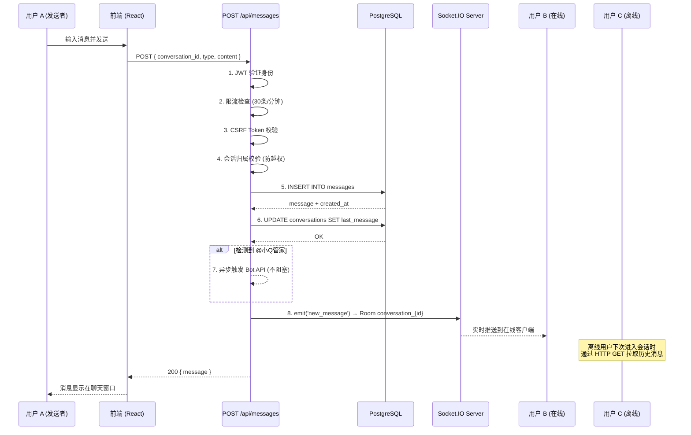
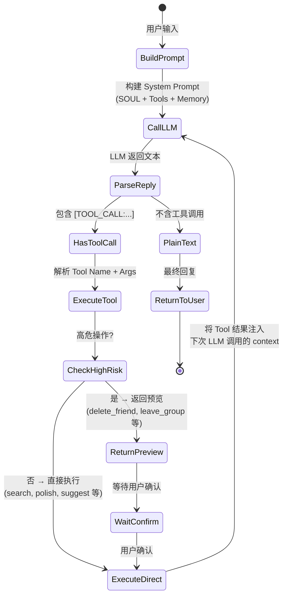

# QQ 网页端 — 系统架构设计文档

> 版本：v1.1  
> 日期：2026-05-01  
> 状态：已落地（v1.1 补完部署视图、序列图、错误策略、日志规范、性能基线）

---

## 1. 项目概述

本项目是一款**全栈即时通讯（IM）网页应用**，模拟 QQ 核心功能，覆盖单聊、群聊、空间动态、AI 智能助手、定时任务等模块。采用**前后端一体化（Full-Stack Monolith）**架构，基于 Next.js App Router 构建，通过自定义 Node.js HTTP 服务器集成 Socket.IO 实现实时通信。

### 1.1 核心能力

| 模块 | 能力描述 |
|------|---------|
| 用户认证 | JWT Token + CSRF 双令牌机制，localStorage 持久化 |
| 即时通讯 | 私聊 / 群聊，文本 / 图片 / 文件消息，历史消息分页加载 |
| 好友管理 | 好友列表、备注、个人资料卡片 |
| 群组系统 | 群成员列表、角色标签（班长/学习委员/老师等） |
| QQ 空间 | 动态发布（文字+图片）、点赞、评论、个人历史动态 |
| AI 管家 | 智能搜索、内容润色、代发消息、表情包匹配、AI 画画、定时任务、向量记忆 |
| 定时任务 | Cron 表达式调度，支持提醒、自动发消息、自动发动态 |

---

## 2. 技术栈总览

### 2.1 前端

| 技术 | 版本 | 用途 |
|------|------|------|
| Next.js | 16.1.1 | 全栈框架（App Router） |
| React | 19.2.3 | UI 库 |
| TypeScript | 5.x | 类型安全 |
| Tailwind CSS | v4 | 原子化样式 |
| shadcn/ui | latest | 基础 UI 组件（基于 Radix UI） |
| Socket.IO Client | 4.8.3 | 实时通信 |
| React Hook Form | 7.70.0 | 表单处理 |
| Zod | 4.3.5 | 运行时校验 |
| Lucide React | 0.468.0 | 图标库 |

### 2.2 后端

| 技术 | 版本 | 用途 |
|------|------|------|
| Next.js API Routes | 16.1.1 | REST API |
| Node.js (Custom Server) | — | 自定义 HTTP + Socket.IO 服务器 |
| Drizzle ORM | 0.45.1 | 类型安全 SQL 构建器 |
| PostgreSQL | — | 主数据库（Supabase） |
| Supabase Client | 2.95.3 | 数据库连接与管理 |
| Redis (ioredis) | 5.10.1 | 限流、缓存、会话辅助 |
| Socket.IO Server | 4.8.3 | 实时消息推送 |
| jose | 6.2.3 | JWT 生成与验证 |
| bcryptjs | 3.0.2 | 密码哈希 |
| cron | 4.4.0 | 定时任务调度 |

### 2.3 外部服务

| 服务 | 用途 |
|------|------|
| OpenAI 兼容 API | LLM 对话、文本生成、流式响应 |
| DashScope (通义万相) | AI 图片生成 |
| Embedding API | 向量生成，用于语义检索 |
| AWS S3 兼容存储 | 文件/图片上传 |

### 2.4 测试与工程化

| 技术 | 用途 |
|------|------|
| Vitest | 单元/集成测试 |
| Playwright | E2E 测试 |
| Testing Library | 组件测试 |
| MSW | API Mock |
| ESLint | 代码质量 |
| pnpm | 包管理 |

---

## 3. 系统整体架构

```
┌─────────────────────────────────────────────────────────────────────┐
│                           客户端 (Browser)                           │
│  ┌──────────────┐  ┌──────────────┐  ┌──────────────┐              │
│  │  React 19    │  │ Socket.IO    │  │ LocalStorage │              │
│  │  + Tailwind  │  │ Client       │  │ (Token/CSRF) │              │
│  └──────────────┘  └──────────────┘  └──────────────┘              │
└────────────────────┬────────────────────────────────────────────────┘
                     │ HTTPS / WSS
┌────────────────────┴────────────────────────────────────────────────┐
│                         Next.js 应用服务器                           │
│  ┌──────────────────────────────────────────────────────────────┐  │
│  │                    Custom Server (Node.js)                    │  │
│  │  ┌─────────────┐  ┌─────────────────┐  ┌─────────────────┐  │  │
│  │  │ Next.js App │  │  Socket.IO      │  │  Cron Scheduler │  │  │
│  │  │  (Pages +   │  │  Server         │  │  (定时任务)      │  │  │
│  │  │   API)      │  │                 │  │                 │  │  │
│  │  └─────────────┘  └─────────────────┘  └─────────────────┘  │  │
│  └──────────────────────────────────────────────────────────────┘  │
│                                                                     │
│  ┌──────────────────────────────────────────────────────────────┐  │
│  │                      API Routes (REST)                       │  │
│  │  /api/auth/*  /api/user  /api/friends  /api/conversations   │  │
│  │  /api/messages  /api/groups  /api/moments  /api/bot         │  │
│  │  /api/upload  /api/settings  /api/tasks                     │  │
│  └──────────────────────────────────────────────────────────────┘  │
└────────────────────┬────────────────────────────────────────────────┘
                     │ SQL (Drizzle ORM)
┌────────────────────┴────────────────────────────────────────────────┐
│                         数据层                                      │
│  ┌──────────────────┐  ┌──────────────────┐  ┌──────────────────┐ │
│  │   PostgreSQL     │  │     Redis        │  │   S3 Storage     │ │
│  │   (Supabase)     │  │   (Rate Limit)   │  │   (Files/Images) │ │
│  └──────────────────┘  └──────────────────┘  └──────────────────┘ │
└─────────────────────────────────────────────────────────────────────┘
                     │ HTTPS
┌────────────────────┴────────────────────────────────────────────────┐
│                      外部 AI 服务                                   │
│  ┌──────────────────┐  ┌──────────────────┐  ┌──────────────────┐ │
│  │ OpenAI 兼容 API  │  │   DashScope      │  │  Embedding API   │ │
│  │ (Chat/Stream)    │  │ (Image Gen)      │  │ (Vector Search)  │ │
│  └──────────────────┘  └──────────────────┘  └──────────────────┘ │
└─────────────────────────────────────────────────────────────────────┘
```

### 3.1 架构风格

- **全栈一体化（Monolith）**：前后端共享 Next.js 运行时，部署单一服务。
- **BFF（Backend for Frontend）**：API 专为前端界面设计，无通用公共 API。
- **自定义服务器**：通过 `src/server.ts` 接管 Next.js 默认服务器，嵌入 Socket.IO 和定时任务调度器。

### 3.2 部署拓扑视图

```
                         ┌─────────────────┐
                         │   CDN / Edge     │
                         │ (Static Assets)  │
                         └────────┬────────┘
                                  │
                         ┌────────┴────────┐
                         │  Nginx / Caddy  │  ← 反向代理 (TLS 终结)
                         │  Reverse Proxy  │
                         └────────┬────────┘
                                  │
              ┌───────────────────┼───────────────────┐
              │                   │                   │
     ┌────────┴────────┐ ┌───────┴───────┐ ┌────────┴────────┐
     │  App Instance 1 │ │ App Instance 2│ │  App Instance N │
     │  (Node.js)      │ │ (Node.js)     │ │  (Node.js)      │
     │  Next.js +      │ │ Next.js +     │ │  Next.js +      │
     │  Socket.IO      │ │ Socket.IO     │ │  Socket.IO      │
     └────────┬────────┘ └───────┬───────┘ └────────┬────────┘
              │                   │                   │
              │    ┌──────────────┼──────────────┐    │
              │    │  Redis Pub/Sub (Socket.IO    │    │
              │    │  Adapter — 跨节点广播)        │    │
              │    └──────────────┼──────────────┘    │
              │                   │                   │
     ┌────────┴───────────────────┴───────────────────┴────────┐
     │                      数据层                              │
     │  ┌──────────────────┐ ┌──────────┐ ┌──────────────────┐ │
     │  │ PostgreSQL       │ │  Redis   │ │  S3 / Supabase   │ │
     │  │ (Supabase)       │ │ (缓存/   │ │  Storage         │ │
     │  │ 主从 + 连接池     │ │  限流)   │ │  (文件/图片)      │ │
     │  └──────────────────┘ └──────────┘ └──────────────────┘ │
     └─────────────────────────────────────────────────────────┘
              │                   │
     ┌────────┴───────────────────┴────────┐
     │            外部服务                   │
     │  OpenAI API │ DashScope │ Embedding  │
     └──────────────────────────────────────┘
```

> **单实例模式（当前）**：仅部署 1 个 App Instance。Socket.IO 无需 Redis Adapter。
> **多实例模式（扩展）**：部署 N 个 App Instance 时必须启用 Redis Adapter（`@socket.io/redis-adapter`），否则不同节点上的客户端无法互通消息。定时任务需迁移至独立 Workers 或引入分布式锁。

---

## 4. 前端架构

### 4.1 路由结构（App Router）

```
src/app/
├── layout.tsx              # 根布局（AuthProvider + ThemeProvider）
├── page.tsx                # 首页（重定向到登录或应用）
├── login/page.tsx          # 登录/注册页面
├── app/
│   ├── page.tsx            # 应用主入口（默认显示聊天列表）
│   ├── chat/[id]/page.tsx  # 聊天窗口页面
│   ├── friends/page.tsx    # 好友列表页面
│   ├── moments/page.tsx    # 空间动态页面
│   ├── profile/page.tsx    # 个人资料页面
│   └── scheduled-tasks/page.tsx  # 定时任务管理
```

### 4.2 状态管理

| 层级 | 方案 | 说明 |
|------|------|------|
| 全局认证状态 | React Context (`AuthContext`) | 用户登录态、Token 管理、自动验证 |
| 服务端状态 | Custom Hooks | `useConversations`, `useFriends`, `useMessages`, `useMoments`, `useTasks` |
| 局部 UI 状态 | `useState` / `useReducer` | 组件内部状态 |

**认证流程**：
1. `AuthProvider` 挂载时从 `localStorage` 读取 `qq_token`
2. 调用 `/api/auth/verify` 验证 Token 有效性
3. 验证通过则设置 `user` 状态，同时获取 `csrf_token`
4. 所有状态变更请求（POST/PUT/DELETE）携带 `X-CSRF-Token`

### 4.3 数据流

```
页面/组件
   │
   ▼
Custom Hooks (useMessages, useFriends, etc.)
   │
   ├──► API Client (src/lib/api.ts) ──► REST API
   │
   └──► Socket Client (src/lib/socket-client.ts) ──► WebSocket
```

- **REST API**：用于初始化数据加载、历史分页、表单提交。
- **WebSocket**：用于实时消息推送、会话状态同步。

### 4.4 组件分层

```
src/components/
├── ui/                     # shadcn/ui 基础组件（Button, Dialog, Card 等）
├── avatar.tsx              # 头像组件（支持颜色/图片）
├── chat-list.tsx           # 会话列表
├── chat-window.tsx         # 聊天窗口（消息渲染、输入框）
├── sidebar.tsx             # 应用侧边栏导航
├── friend-profile-card.tsx # 好友资料卡片
└── message-renderers.tsx   # 消息类型渲染器（文本/图片/文件）
```

---

## 5. 后端架构

### 5.1 自定义服务器（src/server.ts）

由于 Next.js 默认服务器不支持 Socket.IO，项目使用**自定义 Node.js HTTP 服务器**：

```typescript
const server = createServer((req, res) => handle(req, res, parsedUrl));
const io = new Server(server, { path: '/api/socket', ... });
```

**职责分离**：

| 组件 | 职责 |
|------|------|
| Next.js `handle` | 处理页面渲染和 API Routes |
| Socket.IO `io` | 管理 WebSocket 连接、Room 广播 |
| Cron Scheduler | 定时任务注册与执行 |

**Socket.IO 房间设计**：
- `user_${userId}`：用户级私有通知
- `conversation_${conversationId}`：会话级消息广播

### 5.2 API 路由设计

采用 **RESTful + 资源导向** 设计，所有路由位于 `src/app/api/`：

| 资源 | 路由 | 方法 | 读写 | 说明 |
|------|------|------|------|------|
| 认证 | `/api/auth/login` | POST | W | 登录 |
| 认证 | `/api/auth/register` | POST | W | 注册 |
| 认证 | `/api/auth/logout` | POST | W | 登出 |
| 认证 | `/api/auth/verify` | GET | R | 验证登录态 |
| 用户 | `/api/user` | GET | R | 获取用户信息 |
| 用户 | `/api/user` | PUT | W | 更新用户信息 |
| 好友 | `/api/friends` | GET | R | 好友列表 |
| 好友 | `/api/friends/[id]` | GET | R | 好友详情 |
| 好友 | `/api/friends/[id]` | PUT | W | 更新好友备注 |
| 会话 | `/api/conversations` | GET | R | 会话列表 |
| 会话 | `/api/conversations` | POST | W | 创建会话 |
| 会话 | `/api/conversations/[id]` | GET | R | 会话详情 |
| 消息 | `/api/messages` | GET | R | 消息列表（分页） |
| 消息 | `/api/messages` | POST | W | 发送消息 |
| 群组 | `/api/groups` | GET | R | 群列表 |
| 群组 | `/api/groups/members` | GET | R | 群成员 |
| 动态 | `/api/moments` | GET | R | 动态列表 |
| 动态 | `/api/moments` | POST | W | 发布动态 |
| 动态 | `/api/moments/[id]` | PUT | W | 编辑动态 |
| 动态 | `/api/moments/[id]` | DELETE | W | 删除动态 |
| 动态 | `/api/moments/like` | POST | W | 点赞/取消 |
| 动态 | `/api/moments/comment` | POST | W | 评论 |
| 管家 | `/api/bot` | GET | R | 获取 Bot 配置 |
| 管家 | `/api/bot` | POST | W | 发送 Bot 消息 |
| 管家 | `/api/bot/stream` | POST | W | 流式对话 |
| 管家 | `/api/bot/audit-logs` | GET | R | 审计日志 |
| 上传 | `/api/upload` | POST | W | 文件/图片上传 |
| 设置 | `/api/settings` | GET | R | 获取设置 |
| 设置 | `/api/settings` | PUT | W | 更新设置 |
| 任务 | `/api/tasks` | GET | R | 任务列表 |
| 任务 | `/api/tasks` | POST | W | 创建任务 |
| 任务 | `/api/tasks/[id]` | GET | R | 任务详情 |
| 任务 | `/api/tasks/[id]` | PUT | W | 更新任务 |
| 任务 | `/api/tasks/[id]` | DELETE | W | 删除任务 |
| 任务 | `/api/tasks/run` | POST | W | 立即执行 |
| 任务 | `/api/tasks/parse` | POST | R | 解析 Cron |

### 5.3 中间件与横切关注点

| 功能 | 实现位置 | 说明 |
|------|---------|------|
| JWT 验证 | `src/lib/auth-utils.ts` | 从 Cookie/Header 提取并验证 Token |
| CSRF 防护 | `src/lib/csrf.ts` | 状态变更请求必须携带有效 CSRF Token |
| 限流 | `src/lib/rate-limit.ts` / `rate-limit-redis.ts` | 用户级 Redis 限流（如消息 30条/分钟） |
| 请求校验 | `src/lib/validation.ts` | Zod Schema 校验请求体 |
| 日志 | `src/lib/logger.ts` | 结构化日志输出 |
| 安全 Headers | `next.config.ts` | CSP, HSTS, X-Frame-Options 等 |

### 5.4 消息发送与实时推送流程



> **关键时序**：消息先入库（持久化），再广播（实时推送），最后响应客户端。这确保了即使广播失败也不会丢失消息。

### 5.5 统一错误处理

#### 错误响应格式

所有 API 错误统一返回 JSON，格式为：

```json
{
  "error": "人类可读的错误描述"
}
```

部分接口扩展 `code` 字段用于前端精确判断：

```json
{
  "error": "未登录",
  "code": "UNAUTHORIZED"
}
```

#### HTTP 状态码规范

| 状态码 | 场景 | 示例 |
|--------|------|------|
| 200 | 成功 | 正常返回数据 |
| 400 | 请求参数错误 | Zod 校验失败 / 缺少必填字段 |
| 401 | 未登录 | Token 无效或过期 |
| 403 | 无权限 | CSRF 校验失败 / 越权访问其他用户会话 |
| 404 | 资源不存在 | 查询的会话/用户/动态不存在 |
| 409 | 冲突 | 重复点赞 / 重复创建 |
| 429 | 限流 | 超过频率限制 (含 `Retry-After` Header) |
| 500 | 服务器内部错误 | 数据库异常 / 未捕获异常 |

#### Zod 校验统一入口

所有 POST/PUT 请求体通过 `src/lib/validation.ts` 中的 Zod Schema 校验，校验失败直接返回 400：

```typescript
const validated = await validateBody(request, sendMessageSchema);
if (!validated.success) {
  return NextResponse.json({ error: validated.error }, { status: 400 });
}
```

#### 越权防护模式

所有涉及资源归属的 API（消息、会话、动态）均需校验 `userId` 与资源所有者的关系。标准模式见 `src/app/api/messages/route.ts` 中的 `verifyConversationOwnership()` 函数。

### 5.6 日志策略

日志统一通过 `src/lib/logger.ts` 输出，支持结构化日志。

#### 日志级别

| 级别 | 用途 | 生产环境行为 |
|------|------|-------------|
| `debug` | 开发调试信息 | 静默 |
| `info` | 关键业务流程节点（登录、消息发送、任务执行） | 输出 |
| `warn` | 可恢复异常（限流触发、Token 即将过期） | 输出 |
| `error` | 需要关注的错误（数据库异常、LLM 调用失败） | 输出 + 告警 |

#### 敏感信息脱敏规则

| 数据类型 | 脱敏方式 | 示例 |
|---------|---------|------|
| 密码 | 永不记录 | `logger.info('登录', { userId })` 不记录 password |
| Token | 截断 | `token.substring(0, 8) + '...'` |
| 消息内容 | 仅记录长度 | `logger.info('消息已发送', { msgLength: 42 })` |
| 手机号 / QQ 号 | 脱敏 | `1000***01` |

#### 审计追踪

- **操作日志**：所有写 API 的请求记录（用户 ID、操作类型、时间戳、IP）
- **Bot 审计**：独立记录到 `bot_audit_logs` 表（详见 7.4 节）
- **任务执行**：独立记录到 `task_execution_logs` 表（详见 9.3 节）

---

## 6. 数据库架构

### 6.1 ORM 与连接

- **ORM**：Drizzle ORM（类型安全、SQL-like API）
- **数据库**：PostgreSQL（通过 Supabase 托管）
- **Schema 定义**：`src/storage/database/shared/schema.ts`
- **客户端**：`src/storage/database/supabase-client.ts`

### 6.2 实体关系图（ERD）

```
┌─────────────┐       ┌─────────────┐       ┌─────────────┐
│    users    │◄──────┤   friends   │──────►│    users    │
│  (用户)      │       │  (好友关系)  │       │  (好友)      │
└──────┬──────┘       └─────────────┘       └─────────────┘
       │
       │ 1:N              ┌─────────────┐
       ├─────────────────►│   groups    │
       │                  │  (群组)      │
       │                  └──────┬──────┘
       │                         │
       │                         │ 1:N
       │                  ┌──────┴──────┐
       │                  │group_members│
       │                  │  (群成员)    │
       │                  └──────┬──────┘
       │                         │
       │ 1:N                     │
       ▼                         ▼
┌─────────────┐       ┌─────────────┐
│conversations│◄──────┤  messages   │
│  (会话)      │ 1:N   │  (消息)      │
└─────────────┘       └─────────────┘
       ▲
       │ 1:N
       │
┌─────────────┐
│   moments   │◄─────┐
│  (空间动态)  │      │
└─────────────┘      │
       ▲             │
       │ 1:N         │
┌──────┴──────┐      │
│moment_comments│    │
│  (评论)       │    │
└─────────────┘      │
                     │
              ┌──────┴──────┐
              │ moment_likes │
              │  (点赞)       │
              └─────────────┘
```

### 6.3 核心表结构

| 表名 | 用途 | 关键索引 |
|------|------|---------|
| `users` | 用户信息（QQ号、昵称、密码、状态） | qq_number, status |
| `friends` | 双向好友关系（支持备注） | user_id, friend_id |
| `groups` | 群组信息 | name |
| `group_members` | 群成员与角色 | group_id, user_id |
| `conversations` | 用户会话列表（私聊/群聊） | user_id, target_id, last_message_time |
| `messages` | 消息记录（文本/图片/文件/系统） | conversation_id, sender_id, created_at |
| `moments` | 空间动态（内容、图片数组） | user_id, created_at |
| `moment_comments` | 动态评论 | moment_id, user_id |
| `moment_likes` | 动态点赞（唯一约束防重复） | moment_id + user_id (unique) |
| `user_settings` | 用户键值对设置 | user_id + key (unique) |
| `group_role_mappings` | 群角色映射（班长/学习委员等） | user_id, group_id |
| `scheduled_tasks` | 定时任务（Cron 表达式） | user_id, enabled, next_run_at |
| `task_execution_logs` | 任务执行日志 | task_id, status, started_at |
| `bot_audit_logs` | AI 管家审计日志 | user_id, status, created_at |
| `memory_embeddings` | 向量记忆（语义检索） | user_id, category, created_at |

---

## 7. AI 管家（Bot）架构

### 7.1 架构模式：ReAct + Tool Calling

AI 管家采用 **LLM + 工具调用（Tool Calling）** 架构，模拟 ReAct（Reasoning + Acting）模式。核心循环如下：



> **预览确认机制**：所有写操作（`send_message`, `publish_moment`, `delete_friend`, `leave_group`, `edit_moment`, `delete_moment`）默认返回 `preview` 对象，前端渲染确认卡片。用户点击"确认"后，`/api/bot` 收到 `execute_tool: true` 标记，实际执行操作。

#### 错误处理与重试

| 场景 | 策略 |
|------|------|
| LLM API 超时 (>30s) | 返回友好提示 "管家正在思考，请稍后再试" |
| LLM 返回空内容 | 重试 1 次，仍失败则返回默认文案 |
| Tool 执行异常 | 在 LLM 回复中告知用户具体错误 |
| 用户级死锁 (>60s) | 强制释放锁，允许新请求进入 |
| Embedding API 不可用 | 降级为关键词匹配搜索 (ILIKE) |

### 7.2 工具清单（19 个）

| 类别 | 工具 | 说明 |
|------|------|------|
| 身份 | `read_identity` / `write_identity` | 读取/更新管家名称、用户称谓 |
| 记忆 | `read_memory` / `write_memory` / `update_memory_confidence` | 长期记忆读写（支持向量语义检索） |
| 搜索 | `search_messages` / `get_my_messages` | 群聊消息搜索 |
| 内容 | `polish_text` / `suggest_moment` | 文本润色、动态文案建议 |
| 操作 | `send_message` / `publish_moment` | 代发消息、发动态（预览确认模式） |
| 高危 | `delete_friend` / `leave_group` / `edit_moment` / `delete_moment` | 必须预览 + 用户确认 |
| AI 生成 | `generate_image` / `generate_video` | AI 画画/视频（实际调用 DashScope） |
| 任务 | `create_task` | 创建定时任务 |
| 信息 | `get_user_info` | 获取用户基本信息 |

### 7.3 记忆系统（向量 + 结构化）

```
用户对话
   │
   ├──► LLM 提取关键事实 ──► 结构化存储 (user_settings.bot_memory_facts)
   │
   └──► Embedding API 生成向量 ──► memory_embeddings 表
                │
                ▼
        用户查询时：query → Embedding → 余弦相似度计算 → Top-K 召回
```

- **短期记忆**：最近 5 天 Daily Notes
- **长期记忆**：结构化 JSON 事实（preference/fact/event/relationship/goal）
- **向量记忆**：`memory_embeddings` 表，支持语义检索（余弦相似度 > 0.7）

### 7.4 安全机制

- **并发控制**：`userRequestLocks` Map，同一用户串行处理（防死锁超时 60s）
- **预览确认**：所有写操作（发消息、删好友、退群、编辑/删动态）先返回预览，用户确认后执行
- **审计日志**：所有 Bot 请求记录到 `bot_audit_logs` 表（含 latency、tokens、model、tool_calls）

---

## 8. 实时通信架构

### 8.1 Socket.IO 集成

由于 Next.js 原生不支持 Socket.IO，通过自定义服务器集成：

```typescript
// src/server.ts
const io = new Server(server, {
  path: '/api/socket',
  transports: ['websocket', 'polling'],
});

io.use(async (socket, next) => {
  // JWT 认证中间件
  const payload = await verifyTokenString(token);
  socket.data.userId = payload.userId;
});
```

### 8.2 客户端连接

```typescript
// src/lib/socket-client.ts
const socket = io({
  path: '/api/socket',
  auth: { token },
  reconnection: true,
  reconnectionAttempts: 5,
});
```

### 8.3 事件设计

| 事件 | 方向 | 说明 |
|------|------|------|
| `join_conversation` | C→S | 用户进入聊天窗口，加入 Room |
| `leave_conversation` | C→S | 用户离开聊天窗口，退出 Room |
| `new_message` | S→C | 服务端推送新消息到 Room 内所有客户端 |

### 8.4 消息广播流程

```
用户 A 发送 HTTP POST /api/messages
   │
   └──► 消息写入数据库
        │
        └──► globalThis.io.to(`conversation_${id}`).emit('new_message', msg)
                 │
                 ▼
        用户 B (在线，已 join_room) ──► 收到 new_message
        用户 C (离线) ──► 下次进入会话时通过 HTTP GET 拉取
```

---

## 9. 定时任务架构

### 9.1 调度器（src/services/scheduler.ts）

- **启动时机**：自定义服务器启动时 `startScheduler()`
- **周期重载**：每 60 秒从数据库加载启用的任务，自动增删改
- **执行引擎**：`cron` 库（支持 Cron 表达式，时区 Asia/Shanghai）

### 9.2 任务类型

| 类型 | 说明 | 执行逻辑 |
|------|------|---------|
| `reminder` | 定时提醒 | Bot 向用户私聊发送提醒消息 |
| `send_message` | 自动发消息 | 向指定会话发送预设内容 |
| `post_moment` | 自动发动态 | 以用户身份发布空间动态 |

### 9.3 执行保障

- **执行日志**：每次执行写入 `task_execution_logs`（running → success/failed）
- **时间戳更新**：成功后更新 `last_run_at` 和 `next_run_at`
- **幂等设计**：通过 `running` 状态标记防止重复执行

---

## 10. 安全架构

### 10.1 认证与授权

```
┌─────────────┐     ┌─────────────┐     ┌─────────────┐
│  登录请求    │────►│  bcrypt 比对  │────►│ 生成 JWT    │
│ (qq+password)│     │   密码哈希    │     │ (jose, 1h)  │
└─────────────┘     └─────────────┘     └──────┬──────┘
                                                │
                                                ▼
                                    ┌─────────────────────┐
                                    │ 返回 Token + CSRF Token│
                                    │ 存储于 localStorage   │
                                    └─────────────────────┘
                                                │
                ┌───────────────────────────────┼───────────────────────────────┐
                │                               │                               │
                ▼                               ▼                               ▼
        ┌───────────────┐              ┌───────────────┐              ┌───────────────┐
        │  API 请求      │              │  WebSocket    │              │  状态变更请求  │
        │ Authorization  │              │ auth.token    │              │ X-CSRF-Token  │
        │ Bearer <JWT>   │              │               │              │               │
        └───────────────┘              └───────────────┘              └───────────────┘
```

### 10.2 安全防护矩阵

| 威胁 | 防护措施 | 实现 |
|------|---------|------|
| XSS | CSP Header | `default-src 'self'; script-src 'self' 'unsafe-eval'` |
| CSRF | CSRF Token + SameSite Cookie | `X-CSRF-Token` Header 校验 |
| 点击劫持 | X-Frame-Options | `DENY` |
| MIME 嗅探 | X-Content-Type-Options | `nosniff` |
| 重定向劫持 | Referrer-Policy | `strict-origin-when-cross-origin` |
| 暴力破解 | 限流 | Redis 用户级限流（登录/消息/上传） |
| 越权访问 | 会话归属校验 | 所有消息/会话 API 校验用户权限 |
| 密码泄露 | 哈希存储 | bcryptjs 哈希后存储 |

### 10.3 限流策略

| 接口 | 策略 |
|------|------|
| 消息发送 | 30 条/分钟/用户 |
| Bot 调用 | 按全局/用户配置 |
| 文件上传 | 按全局配置 |

#### 限流降级策略

| 场景 | 降级行为 |
|------|---------|
| Redis 可用 | 正常限流（Redis 计数器） |
| Redis 不可用（连接超时） | 降级为**内存限流**（`src/lib/rate-limit.ts` 中的 Map-based 实现），进程级别隔离 |
| Redis 不可用 + 重启 | 限流计数归零，短时间内容忍少量超额请求 |
| 限流存储方案切换 | 平滑切换，不阻塞正常请求。调用 `checkUserRateLimit()` 时自动选择 Redis → Memory fallback |

> **实现说明**：`src/lib/rate-limit-redis.ts`（Redis 实现）和 `src/lib/rate-limit.ts`（内存实现）共享相同接口。当 Redis 客户端连接失败时，`checkUserRateLimit()` 函数自动降级到内存方案。

---

## 11. 部署与运维

### 11.1 构建流程

```bash
# 开发
pnpm dev              # 启动开发服务器 (tsx scripts/run.ts dev)

# 生产构建
pnpm build            # Next.js build (tsx scripts/run.ts build)

# 生产启动
pnpm start            # 启动生产服务器 (tsx scripts/run.ts start)
```

### 11.2 环境变量

| 变量 | 说明 |
|------|------|
| `COZE_SUPABASE_URL` | Supabase 项目 URL |
| `COZE_SUPABASE_ANON_KEY` | Supabase 匿名密钥 |
| `COZE_SUPABASE_SERVICE_ROLE_KEY` | Supabase 服务密钥 |
| `OPENAI_API_KEY` | LLM API 密钥 |
| `OPENAI_BASE_URL` | LLM API 基础地址 |
| `OPENAI_MODEL` | 默认模型（如 gpt-4o-mini） |
| `OPENAI_IMAGE_MODEL` | 图片生成模型（如 wanx2.1-t2i-turbo） |
| `REDIS_URL` | Redis 连接地址 |
| `COZE_PROJECT_ENV` | 环境标识（PROD/DEV） |
| `PORT` | 服务端口（默认 5000） |

### 11.3 数据库运维

```bash
# 本地数据库（Docker）
pnpm db:up            # 启动 PostgreSQL
pnpm db:init          # 初始化 Schema
pnpm db:seed          # 导入种子数据
pnpm db:migrate:20260428  # 执行迁移
```

### 11.4 测试策略（测试金字塔）

```
         ╱  E2E  ╲          Playwright — 关键用户流程（登录→聊天→发动态）
        ╱  (少量)  ╲         覆盖：登录、消息发送、空间发布、Bot 对话
       ╱─────────────╲
      ╱  API 集成测试  ╲      Vitest — 每个 API Route 的完整链路
     ╱   (适量)        ╲      覆盖：认证、CRUD、权限校验、限流
    ╱───────────────────╲
   ╱   组件测试           ╲    Vitest + Testing Library — UI 交互
  ╱    (较多)             ╲   覆盖：渲染、事件、状态变更、条件分支
 ╱─────────────────────────╲
╱  单元测试 (最底层，最多)    ╲  Vitest — 纯逻辑函数
╲  utils, validation, csrf, ╱ 覆盖：边界值、异常分支、类型窄化
 ╲  rate-limit, auth-utils ╱
  ╲────────────────────────╱
```

#### 各层 Mock 策略

| 层级 | Mock 对象 | 工具 | 说明 |
|------|---------|------|------|
| 单元测试 | 外部依赖 | Vitest mock | 数据库、API 调用全部 mock |
| 组件测试 | API 层 | MSW (`msw`) | 模拟 API 响应，验 UI 行为 |
| API 集成测试 | 数据库 | Supabase 测试实例 | 连接真实 DB 或本地 Docker PG |
| E2E 测试 | 无 | Playwright | 全真环境，连接本地完整服务 |

#### 测试命令

| 类型 | 命令 | 说明 |
|------|------|------|
| 单元 + 组件 + API | `pnpm test` | Vitest run（所有 .test.ts/.test.tsx） |
| 监听模式 | `pnpm test:watch` | 开发时持续运行 |
| 覆盖率 | `pnpm test:coverage` | 生成 coverage 报告 |
| E2E 测试 | `pnpm test:e2e` | Playwright 运行 E2E |
| 全量测试 | `pnpm test:all` | Vitest + Playwright 串联 |

### 11.5 性能基线

> **状态**：基准待测量，以下为设计目标（placeholder）。实际数据需在压测后填入。

| 指标 | 设计目标 | 实测值 | 测量工具 |
|------|---------|--------|---------|
| 消息发送延迟 (P50) | < 200ms | 待测量 | k6 / autocannon |
| 消息发送延迟 (P99) | < 1s | 待测量 | k6 / autocannon |
| 消息推送延迟 (Socket.IO) | < 100ms | 待测量 | 自定义脚本 |
| Bot 响应时间 (P50) | < 3s | 待测量 | `bot_audit_logs.latency_ms` |
| Bot 响应时间 (P99) | < 10s | 待测量 | `bot_audit_logs.latency_ms` |
| API QPS (单实例) | > 500 | 待测量 | k6 |
| Socket.IO 并发连接 | > 1000 | 待测量 | artillery / k6 |
| 数据库连接池 | 20 (pg Pool) | — | `pg.poolSize` 配置 |
| 图片上传 (1MB) | < 2s | 待测量 | S3 upload |
| 首屏加载时间 (LCP) | < 2.5s | 待测量 | Lighthouse |
| 页面交互延迟 (INP) | < 200ms | 待测量 | Lighthouse |

---

## 12. 关键设计决策

| 决策 | 选型 | 理由 |
|------|------|------|
| 全栈框架 | Next.js App Router | 前后端同构、SSR/SSG 支持、生态成熟 |
| 数据库 ORM | Drizzle ORM | 类型安全、SQL-like API、轻量 |
| 实时通信 | Socket.IO | 兼容性好、自动降级 polling、Room 管理便捷 |
| 状态管理 | React Context + Hooks | 项目规模适中，无需引入 Redux/Zustand |
| AI 架构 | LLM + Tool Calling | 灵活扩展工具、可控性强、成本可控 |
| 记忆系统 | 结构化 JSON + 向量 Embedding | 兼顾精确检索与语义相似度搜索 |
| 定时任务 | 进程内 Cron | 项目规模下足够，避免引入外部队列复杂度 |
| 文件存储 | S3 兼容 | 解耦存储、支持 CDN、成本可控 |

---

## 13. 扩展性考量

### 13.1 水平扩展瓶颈

| 组件 | 瓶颈 | 建议 |
|------|------|------|
| Socket.IO | 单节点内存存储 | 引入 Redis Adapter（`socket.io-redis-adapter`） |
| 定时任务 | 单进程调度 | 迁移至分布式调度（如 Bull + Redis） |
| Bot 并发 | 内存级用户锁 | 引入分布式锁（Redis Redlock） |

### 13.2 数据库优化方向

- **消息表分片**：按 conversation_id 或时间范围分区
- **向量检索**：迁移至 pgvector 原生 `vector` 类型 + ivfflat/hnsw 索引
- **读分离**：引入只读副本分担查询压力

---

## 14. 附录

### 14.1 目录结构

```
src/
├── app/                      # Next.js App Router
│   ├── api/                  # API 路由
│   ├── app/                  # 主应用页面（需登录）
│   ├── login/                # 登录注册页面
│   ├── layout.tsx            # 根布局
│   ├── page.tsx              # 首页
│   └── globals.css           # 全局样式 + 主题变量
├── components/               # React 组件
│   ├── ui/                   # shadcn/ui 基础组件
│   └── *.tsx                 # 业务组件
├── lib/                      # 工具库
│   ├── api.ts                # API 请求封装
│   ├── auth-context.tsx      # 认证上下文
│   ├── auth-utils.ts         # JWT 工具
│   ├── hooks.ts              # 自定义 Hooks
│   ├── types.ts              # TypeScript 类型定义
│   ├── utils.ts              # 通用工具（cn 等）
│   ├── validation.ts         # Zod Schema
│   ├── csrf.ts               # CSRF 工具
│   ├── rate-limit.ts         # 限流逻辑
│   ├── redis.ts              # Redis 客户端
│   ├── socket-client.ts      # Socket.IO 客户端
│   └── logger.ts             # 日志工具
├── services/                 # 后端服务
│   └── scheduler.ts          # 定时任务调度器
├── storage/
│   └── database/
│       ├── shared/
│       │   ├── schema.ts     # Drizzle Schema
│       │   └── relations.ts  # 关系定义
│       └── supabase-client.ts # Supabase 客户端
└── server.ts                 # 自定义服务器入口
```

### 14.2 参考资料

- [Next.js 官方文档](https://nextjs.org/docs)
- [Drizzle ORM 文档](https://orm.drizzle.team)
- [Socket.IO 文档](https://socket.io/docs/v4/)
- [Supabase 文档](https://supabase.com/docs)
